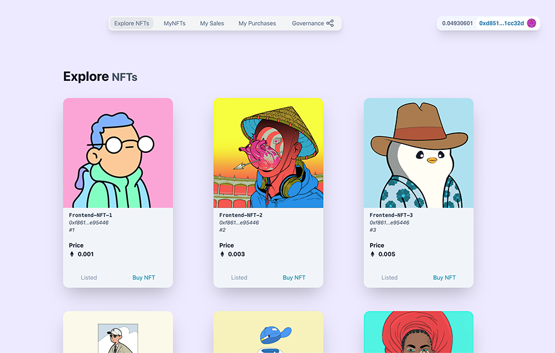

# Governed NFT Marketplace

A truly decentralized NFT Marketplace allowing users to buy/sell NFTs using regular ETH and ERC20 tokens.

()

- [Governed NFT Marketplace](#governed-nft-marketplace)
  - [About](#about)
  - [Frontend](#frontend)
  - [Contracts](#contracts)
    - [NftMarketplace](#nftmarketplace)
    - [NftMarketplaceGovernor](#nftmarketplacegovernor)
    - [NftMarketplaceGovernanceToken](#nftmarketplacegovernancetoken)
  - [Built Using](#built-using)
  - [Usage](#usage)
    - [Hardhat](#hardhat)
      - [Prerequisites](#prerequisites)
      - [Testing](#testing)
      - [Deployment](#deployment)
      - [Scripts](#scripts)
  - [License](#license)
  - [Contact](#contact)

## About

Popular NFT markets like Opensea or Rarible do provide an easy way for users to buy and sell NFTs. Nevertheless, these are at least partially centralized services that stand in stark contrast to the very principles of decentrality.

This demo project should give an insight into how centrality can be mitigated by using the newest blockchain technologies. Governance through a democratized on-chain voting system makes this marketplace truly fair and brings
back core features of decentrality.

## Frontend

The [Webpage]() provides a way to intuitively and easily use the decentralized Marketplace.

## Contracts

The project consists of three main contracts (NftMarketplace, NftMarketplaceGovernor, NftMarketplaceGovernanceToken).

Implemented together, these provide a decentralized NFT marketplace, which is governed decentrally by governance token holders (shareholders), that govern the marketplace through the governor contract (NftMarketplaceGovernor).

All of the contracts are designed to be upgradeable using the Governor.

### NftMarketplace

This contract is designed to allow users to buy and sell NFTs using ETH and ERC20 tokens.

The Contract implements a "state" feature, which can be set by the owner of the contract (designed
to be the Governor contract). These states include CLOSED, UPDATING, OPEN. This allows for restricting functionality when updating or closing the marketplace.

ERC20 tokens can be listed as "payment tokens", e.g. tokens allowed to be used as payment methods
for NFTs. Adding/removing payment tokens can only be done by the Governor.

Adding NFTs to the marketplace can be done by NFT holders by specifying a price and ERC20 tokens that should also be accepted as payment (this is optional if one only wants to accept ETH. If added though, these have to be approved as payment tokens by the marketplace prior). This can only be done if the market is approved to transfer the NFT on behalf of the seller (for transferring the NFT to the buyer when being purchased).

The price of an NFT listed on the marketplace and the payment tokens of the listing can be updated by the NFT owner. An NFT listed on the marketplace can also be removed by its owner.

Buying NFTs can be done by paying with ETH, or with tokens specified by the seller (payment tokens). If paying with ERC20 tokens, the buyer has to approve the marketplace for transferring the amount of tokens needed to the seller prior to buying the NFT. The amount of tokens needed can be retrieved by a function implemented in the contract.

This contract is designed to be upgradeable.

- For a detailed documentation of the functionality and code of the NftMarketplace contract see [NftMarketplace Documentation](./docs/NftMarketplace.md)

### NftMarketplaceGovernor

This contract functions as the governor and owner of the marketplace. Governance token holders can propose new proposals and vote on proposals. These proposals may include using access-restricted features of the NftMarketplace contract or upgrading the NftMarketplace, NftMarketGovernanceToken or the NftMarketplaceGovernor contract.

This contract is designed to be upgradeable.

### NftMarketplaceGovernanceToken

This contracts specifies the governance token for shareholders of the marketplace. It is an implementation of an ERC20 token.

This contract is designed to be upgradeable.

- For a detailed explanation of ERC20 tokens see [ERC-20 Token Standard](https://ethereum.org/en/developers/docs/standards/tokens/erc-20/)

## Built Using

This project was built using multiple frameworks, the most notable ones being below.

- [Hardhat](https://hardhat.org/)
- [NextJS](https://nextjs.org/)
- [TheGraph](https://thegraph.com/)
- [Moralis](https://moralis.io/)
- [Ethers](https://ethers.io/)
- [Waffle](https://getwaffle.io/)
- [OpenZeppelin-Contracts](https://openzeppelin.com/contracts)
- [Chainlink-Data-Feeds](https://docs.chain.link/docs/using-chainlink-reference-contracts/)

## Usage

The project can be used through the live implementation on Ethereum Mainnet. (insert link)

Apart from that, one may clone this repo and use the Hardhat project on its own.

### Hardhat

The Hardhat project consists of the Smart Contracts, tests, scripts and overall backend functionality of the project.

#### Prerequisites

1. Clone the repo
   ```sh
   git clone https://github.com/keinberger/sol-governed-nft-marketplace
   ```
2. Make sure you have a node package manager like [YARN](https://yarnpkg.com/) or [NPM](https://docs.npmjs.com/downloading-and-installing-node-js-and-npm) installed
3. Install dependencies
   ```sh
   yarn install
   ```
4. Edit `hardat.config.js` and `helper-hardhat-config.js` to fit your needs.

#### Testing

To test the contracts for functionality run the command below

```sh
yarn hardhat test
```

#### Deployment

In order to deploy the contracts on a blockchain run

```sh
yarn hardhat deploy (optional: network)
```

The deploy scripts will take care of setting up the contracts, so access-control,
upgradeability and other features are set up properly.

> **Note**: The deployer still retains all governance tokens after deployment. In a real implementation of the project, the tokens would need to be
> distributed among shareholders of the project, to provide true decentralized governance of the marketplace.

#### Scripts

The repo provides several scripts for interacting with the NftMarketplace itself and its Governor (DAO), which can be found in the `scripts/` folder.

The scripts uses the `helper-hardhat-config.js` for input values. In order to run these scripts, you have
to edit the `scriptsConfig` section and the corresponding `governance` and `nftMarketplace` objects
accordingly.

<p align="right">(<a href="#governed-nft-marketplace">back to top</a>)</p>

## License

Distributed under the GPL-3.0 License. See `LICENSE` for more information.

<p align="right">(<a href="#governed-nft-marketplace">back to top</a>)</p>

## Contact

Philipp Keinberger - [@phil10013](https://twitter.com/phil10013) - philipp.keinberger@gmail.com

Project Link: [https://github.com/keinberger/sol-governed-nft-marketplace](https://github.com/keinberger/sol-governed-nft-marketplace)

<p align="right">(<a href="#governed-nft-marketplace">back to top</a>)</p>
